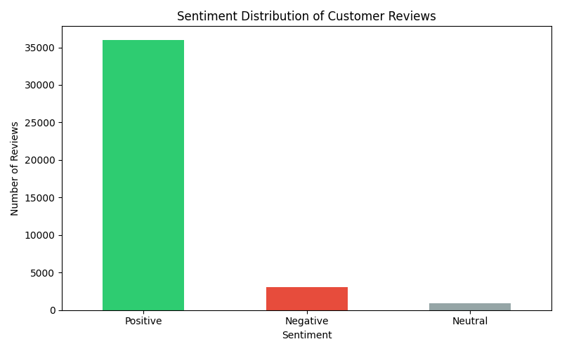
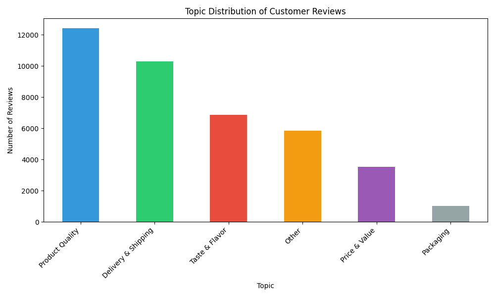
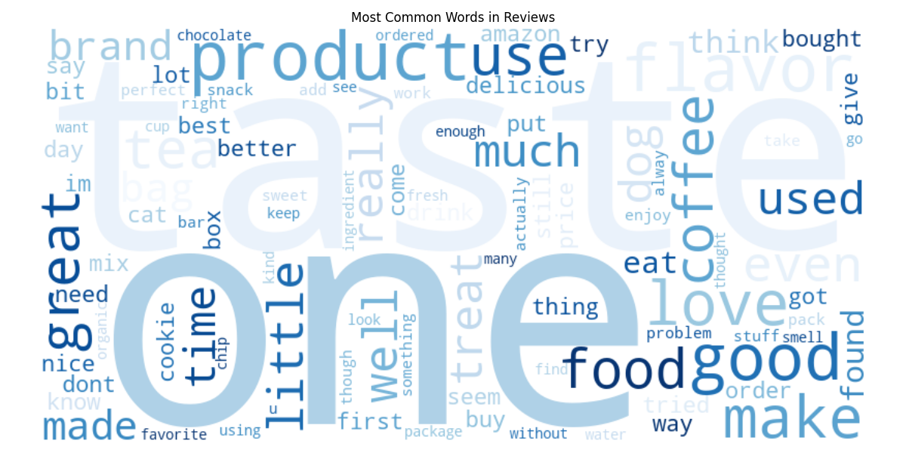

# 🛍️ Customer Review Sentiment Analysis

Analysis of 40,000+ Amazon customer reviews using Python and NLP to extract 
business insights about customer satisfaction.


---

## 📊 Live Dashboard
Run locally with:
```bash
python -m streamlit run dashboard.py
```

---

## 🎯 Project Objectives
- Analyze customer sentiment across 40,000 reviews
- Classify reviews into business topics
- Identify key pain points to improve customer satisfaction
- Visualize insights through an interactive dashboard

---

## 🔍 Key Findings
- **90.1%** of reviews are positive — strong overall customer satisfaction
- **Product Quality** is the most discussed topic (31.1%)
- **Delivery & Shipping** accounts for 24.4% of all negative reviews
- **Taste & Flavor** dominates word frequency — typical for food products

---

## 🛠️ Tech Stack
| Tool | Usage |
|------|-------|
| Python | Core programming language |
| Pandas & NumPy | Data manipulation |
| VADER | Sentiment analysis |
| Matplotlib & Seaborn | Data visualization |
| Streamlit | Interactive dashboard |
| NLTK | Text preprocessing |

---

## 📁 Project Structure     
sentiment_project/
│
├── Data/
│   ├── Reviews.csv               # Raw dataset
│   └── analyzed_reviews.csv      # Processed results
│
├── notebooks/
│   └── sentiment_analysis.ipynb  # Full analysis
│
├── Images/                       # Generated charts
│
├── dashboard.py                  # Streamlit dashboard
└── README.md
---

## ⚙️ Installation

```bash
# Clone the repository
git clone https://github.com/AyaRahmouny/customer-review-sentiment-analysis

# Install dependencies
pip install pandas numpy matplotlib seaborn nltk vaderSentiment wordcloud streamlit --user

# Run the dashboard
python -m streamlit run dashboard.py
```

---

## 📈 Dashboard Preview

### Sentiment Distribution


### Topic Analysis


### Word Cloud


---

## 💡 Limitations & Future Improvements
- VADER struggles with mixed-sentiment reviews
- Keyword-based topic classification can be replaced with LDA
- Could be improved with a fine-tuned transformer model (BERT)

---

## 👩‍💻 Author
**Aya Rahmouny** — Data Analyst  
[LinkedIn](https://linkedin.com/in/aya-rahmouny) | 
[GitHub](https://github.com/AyaRahmouny)